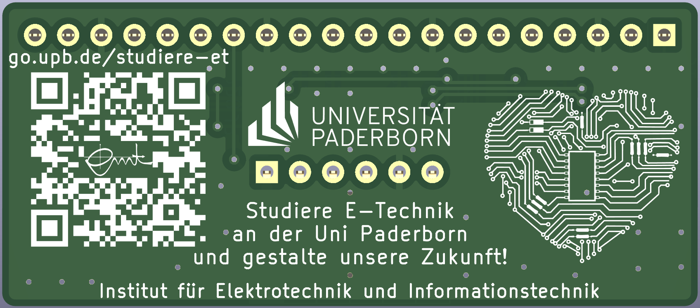

Extension board for Raspberry Pi Pico
=====================================

This pcb is designed as an extension for the Raspberry Pi Pico microcontroller. It features two red-green-blue leds, a button and a `Pmod interface <https://digilent.com/reference/pmod/start>`_.

Special thanks to Karl Dören for his work!

Interactive BOM
===============
An interactive html BOM page with pcb layout and material placement can be found `here <https://emtpb.github.io/pico-hw-rgb/bom/ibom.html>`_.
